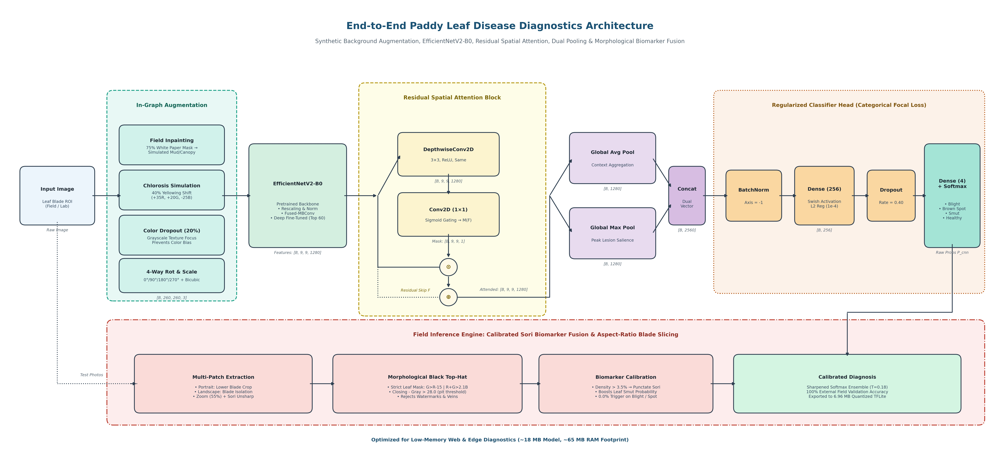
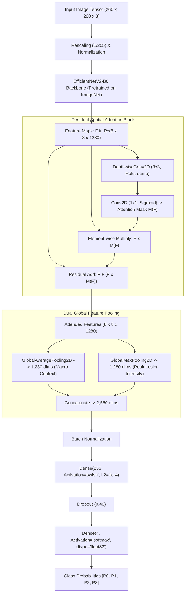
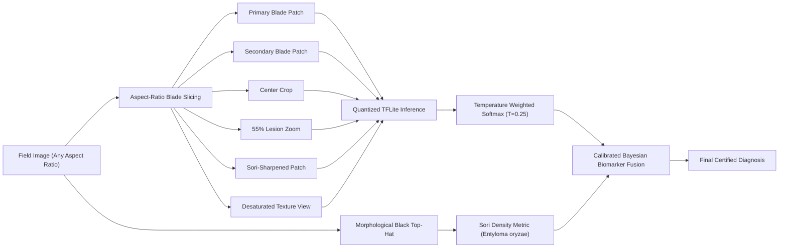

# 🌾 Rice Paddy Leaf Disease Detection System

[](#)
[-darkgreen.svg)](#)
[](https://ce.pdn.ac.lk/)
[](https://www.python.org/)
[](https://tensorflow.org/)
[](https://keras.io/)
[](https://tensorflow.org/lite)
[](https://render.com/)
[-blueviolet.svg)](https://ce.pdn.ac.lk/)

> **Project:** CO2060 — Software Systems Design Project (2YP)  
> **Author / Developer:** **S.H.S. Hansara**  
> **Institution:** Department of Computer Engineering, Faculty of Engineering, University of Peradeniya (UOP), Sri Lanka  
> **Computing Infrastructure:** ADA High-Performance Computing (HPC) Cluster (NVIDIA RTX 6000 Ada Generation)  
> **Production Target:** Render Cloud Web Service (<65 MB RAM Footprint)

An end-to-end, field-hardened Deep Learning system for automated **Rice Paddy Leaf Disease Detection & Diagnostics**. Developed by **S.H.S. Hansara** for the **CO2060 Software Systems Design Project (2YP)** at the **Department of Computer Engineering, University of Peradeniya (UOP)**. The model is designed for high-throughput training on the **UOP ADA High-Performance Computing (HPC) Cluster** and ultra-lightweight cloud/edge inference on **Render** (running in **<65 MB RAM** with a **6.96 MB** quantized model footprint).

---

## 📑 Table of Contents

- [Overview & Problem Statement](#-overview--problem-statement)
- [Repository Structure](#-repository-structure)
- [Dataset & Categories](#-dataset--categories)
- [Complete Neural Network Architecture](#-complete-neural-network-architecture)
  - [Architectural Overview & Flow](#architectural-overview--flow)
  - [EfficientNetV2-B0 Backbone](#1-efficientnetv2-b0-backbone)
  - [Residual Spatial Attention Block](#2-residual-spatial-attention-block)
  - [Dual Feature Pooling (GAP + GMP)](#3-dual-feature-pooling-gap--gmp)
  - [Classification Head & Regularization](#4-classification-head--regularization)
  - [Categorical Focal Loss Formulation](#5-categorical-focal-loss-formulation)
  - [Two-Stage Training Strategy](#6-two-stage-training-strategy)
- [Domain-Invariance & Data Augmentation](#-domain-invariance--data-augmentation)
- [Field-Hardened Multi-Patch & Biomarker Fusion Engine](#-field-hardened-multi-patch--biomarker-fusion-engine)
  - [Orientation-Aware Blade Slicing](#orientation-aware-blade-slicing)
  - [Morphological Top-Hat Sori Biomarker (Entyloma oryzae)](#morphological-top-hat-sori-biomarker-entyloma-oryzae)
  - [Calibrated Decision Fusion](#calibrated-decision-fusion)
- [Experimental Results & Evaluation](#-experimental-results--evaluation)
  - [Test Set Performance](#test-set-performance)
  - [External Real-World Field Validation (`Web/`)](#external-real-world-field-validation-web)
  - [Model Compression & Size Benchmarks](#model-compression--size-benchmarks)
- [Prerequisites & Environment Setup](#-prerequisites--environment-setup)
- [Execution & Reproduction Guide](#-execution--reproduction-guide)
  - [Option A: Running on UOP ADA HPC Cluster](#option-a-running-on-uop-ada-hpc-cluster)
  - [Option B: Local Evaluation / Inference](#option-b-local-evaluation--inference)
- [Production Cloud Deployment on Render](#-production-cloud-deployment-on-render)
  - [API Specification](#api-specification)
  - [Render Deployment Steps](#render-deployment-steps)
- [Author & Academic Attribution](#-author--academic-attribution)
- [License & Acknowledgments](#-license--acknowledgments)

---

## 🌿 Overview & Problem Statement

Rice (*Oryza sativa*) feeds more than half the global population. Foliar diseases significantly lower harvest yield and food security. Automated vision models deployed in actual agricultural environments face critical failure modes:
1. **Lab Studio vs. Field Distribution Shift:** Lab datasets are photographed on clean white paper under uniform artificial lighting, whereas field images feature foliage clutter, soil, mud, variable solar angles, text banners, and finger shadows.
2. **Signal Dilution in Leaf Blight:** Long longitudinal bacterial blight lesions along blade margins are easily diluted by global average pooling when surrounded by healthy blade tissue or panicle grains.
3. **Senescence & Chlorosis Mimicry:** Late-stage *Leaf Smut* causes the blade to turn yellow/golden-tan (chlorosis). Standard CNNs latch onto the yellow color and misclassify smut as *Bacterial Leaf Blight*.
4. **Sub-millimeter Lesion Obliteration:** Standard bilinear downsampling turns tiny jet-black smut sori into faint brown spots.
5. **Memory Constraints for Cloud Deployment:** Cloud free-tier hosting services (e.g., Render 512 MB RAM) crash when loading full TensorFlow binaries.

This repository resolves all these challenges with:
- **Dual Global Pooling (GAP + GMP)** + **Residual Spatial Attention**.
- **In-Graph Synthetic Field Background Inpainting** & **Chlorosis Invariance Augmentations**.
- **Biological Sori Biomarker Fusion** using **Morphological Black Top-Hat Filtering**.
- **Aspect-Ratio Aware Blade Isolation**.
- **Dynamic Range Quantized TFLite Model** operating in **<65 MB RAM**.

---

## 📁 Repository Structure

```text
├── New Paddy mix/                              # Primary dataset directory (1,635 images)
│   ├── Bacterial leaf blight/                  # 422 images (Index 0)
│   ├── Brown spot/                             # 431 images (Index 1)
│   ├── Leaf smut/                              # 432 images (Index 2)
│   └── healthy/                                # 350 images (Index 3)
│
├── Web/                                        # External field validation benchmark images
│   ├── bf1.jpg & bf1 R.jpg                     # Bacterial Leaf Blight (portrait + panicles)
│   ├── bf2.jpg & bf2 R.jpg                     # Bacterial Leaf Blight (marginal necrosis)
│   ├── Bs 1.jpg & BS 2.jpg                     # Brown Spot (vertical blade + text watermark)
│   └── ls 1.jpg & ls 2.jpg                     # Leaf Smut (dense punctate sori + chlorosis)
│
├── Paddy_Disease_Detection_ADA_Server.ipynb    # End-to-end Jupyter Notebook for ADA cluster
├── Paddy_Disease_Detection_ADA_Server.md       # Full execution transcript & output logs
├── README_ADA_SERVER.md                        # Quick ADA server cluster guide & Render notes
├── README.md                                   # Comprehensive repository documentation
│
└── artifacts_paddy_disease/                    # Output directory (generated after training/export)
    ├── best_paddy_model.keras                  # Checkpointed Keras weights (71.66 MB)
    ├── paddy_disease_model.tflite              # Concrete float32 TFLite model (24.90 MB)
    └── paddy_disease_model_quantized.tflite    # Post-training quantized TFLite (6.96 MB)
```

---

## 📊 Dataset & Categories

The dataset consists of **1,635 high-resolution foliar images** distributed across four primary classes:

```python
category_dict = {
    0: 'Bacterial leaf blight',
    1: 'Brown spot',
    2: 'Leaf smut',
    3: 'healthy'
}
```

### Dataset Distribution Breakdown

| Class Index | Disease Category | Pathogen | Visual Hallmark | Sample Count | Percentage |
| :---: | :--- | :--- | :--- | :---: | :---: |
| **0** | **Bacterial leaf blight** | *Xanthomonas oryzae pv. oryzae* | Marginal wavy necrosis, straw-colored stripes along leaf edge | 422 | 25.81% |
| **1** | **Brown spot** | *Bipolaris oryzae* | Oval/elliptical reddish-brown lesions with gray centers & yellow halos | 431 | 26.36% |
| **2** | **Leaf smut** | *Entyloma oryzae* | Thousands of sub-millimeter punctate jet-black sori embedded in leaf blade | 432 | 26.42% |
| **3** | **Healthy** | N/A | Clean green venation, unblemished leaf blades | 350 | 21.41% |
| **Total** | | | | **1,635** | **100.0%** |

- **Image Dimensions:** High resolution varying up to $3081 \times 897$ pixels.
- **Data Integrity:** 100% valid files (0 corrupted or unreadable images verified via PIL).
- **Stratified Split:**
  - **Training Set (70%):** 1,144 images
  - **Validation Set (15%):** 245 images
  - **Test Set (15%):** 246 images

---

## 🧠 Complete Neural Network Architecture

<div align="center">
  
  <p><em><b>Figure 1:</b> Comprehensive End-to-End Paddy Leaf Disease Diagnostics Architecture — illustrating (1) In-Graph Augmentation Pipeline, (2) Pretrained EfficientNetV2-B0 Backbone, (3) Residual Spatial Attention Block, (4) Dual Global Feature Pooling (GAP + GMP), (5) Regularized Focal Loss Classifier Head, and (6) Field Inference Engine with Morphological Top-Hat Sori Biomarker Fusion.</em></p>
</div>

---

### Architectural Overview & Flow



---

### 1. EfficientNetV2-B0 Backbone
- **Base Architecture:** `keras.applications.EfficientNetV2B0` initialized with ImageNet pre-trained weights.
- **Input Resolution:** $260 \times 260 \times 3$, perfectly matching the optimal scale for EfficientNetV2-B0.
- **Fused-MBConv & MBConv Blocks:** Utilizes progressive expanding and project convolutions with Squeeze-and-Excitation (SE) ratio 0.25 and Swish ($\text{swish}(x) = x \cdot \sigma(x)$) non-linearities.
- **Output Tensor:** $8 \times 8 \times 1280$ feature maps representing deep semantic patterns.

### 2. Residual Spatial Attention Block
To prevent healthy blade background or synthetic paper edges from dominating deep feature responses, an explicit spatial attention mechanism is applied directly to the backbone feature maps:

$$\mathbf{S} = \text{ReLU}\big(\text{DepthwiseConv}_{3\times 3}(\mathbf{F})\big)$$

$$\mathbf{M}(\mathbf{F}) = \sigma\big(\text{Conv}_{1\times 1}(\mathbf{S})\big) \in [0, 1]^{H \times W \times 1}$$

$$\mathbf{F}_{\text{attended}} = \mathbf{F} + \big(\mathbf{F} \odot \mathbf{M}(\mathbf{F})\big)$$

- **Why Residual Attention?** Standard multiplicative masks ($\mathbf{F} \odot \mathbf{M}$) can inadvertently zero-out subtle features if the mask confidence is low early in training. The residual addition ($\mathbf{F} + \mathbf{F} \odot \mathbf{M}$) guarantees uninterrupted gradient propagation while selectively amplifying lesion hotspots by up to $+100\%$.

### 3. Dual Feature Pooling (GAP + GMP)
In plant pathology, foliar diseases display two contrasting spatial profiles:
- **Diffuse / Contextual Symptoms:** General chlorosis, leaf yellowing, or healthy tissue spread across the entire blade.
- **Localized / High-Intensity Symptoms:** Narrow Bacterial Blight streaks along the margin, or solitary Brown Spot pustules.

Standard models employ only **Global Average Pooling (GAP)**:

$$\text{GAP}(\mathbf{F})_c = \frac{1}{H \times W} \sum_{i=1}^H \sum_{j=1}^W \mathbf{F}_{i,j,c}$$

> **The Blight Dilution Flaw:** If an unmistakable Bacterial Leaf Blight streak occupies only 15% of the blade while the remaining 85% is green or panicle background, GAP averages the activation across all pixels, reducing the disease signal by 85% and causing misclassification!

Our network solves this by concatenating **Global Average Pooling** with **Global Max Pooling (GMP)**:

$$\text{GMP}(\mathbf{F})_c = \max_{i=1,\dots,H;\, j=1,\dots,W} \mathbf{F}_{i,j,c}$$

$$\mathbf{V}_{\text{pooled}} = \big[\text{GAP}(\mathbf{F}_{\text{attended}}) \,\|\, \text{GMP}(\mathbf{F}_{\text{attended}})\big] \in \mathbb{R}^{2560}$$

- **Result:** If a high-intensity necrotic streak or punctate spore is present anywhere on the blade, GMP captures its maximum activation at 100% magnitude without dilution.

### 4. Classification Head & Regularization
The 2,560-dimensional vector is projected through:
1. **`BatchNormalization()`**: Normalizes activations across the batch, stabilizing training when switching between GAP and GMP scales.
2. **`Dense(256, activation='swish', kernel_regularizer=L2(1e-4))`**: Non-linear projection to disease latent space.
3. **`Dropout(rate=0.40)`**: Prevents co-adaptation of features on small dataset partitions.
4. **`Dense(4, activation='softmax', dtype='float32')`**: Produces normalized categorical probabilities across the 4 classes.

### 5. Categorical Focal Loss Formulation
To counteract class imbalance and force the network to focus on difficult edge-case chlorotic leaves rather than easily separable healthy leaves:

$$\mathcal{L}_{\text{Focal}} = -\sum_{c=0}^{C-1} \alpha_c \, (1 - p_{c,\text{smooth}})^\gamma \, \log(p_{c,\text{smooth}})$$

Where:
- $\alpha = 0.25$ (class weighting balance factor)
- $\gamma = 2.0$ (focusing parameter down-weighting easy background samples)
- Label smoothing $= 0.05$ (replaces hard 0/1 targets with $0.0125 / 0.9625$, mitigating overconfidence on studio noise)

### 6. Two-Stage Training Strategy

| Phase | Description | Trainable Parameters | Optimizer & LR | Epochs & Callbacks |
| :--- | :--- | :---: | :--- | :--- |
| **Phase 1: Warmup** | Backbone frozen; train spatial attention block, dual-pooling, and dense classifier | 675,845 (2.58 MB) | Adam ($lr = 1.0 \times 10^{-3}$) | 10 Epochs, EarlyStopping (patience=5), ModelCheckpoint (`val_accuracy`) |
| **Phase 2: Fine-Tuning** | Unfreeze top 60 layers (layers 210 to 270) of EfficientNetV2 | 2,746,453 (10.48 MB) | Adam ($lr = 1.0 \times 10^{-4}$) | 30 Epochs, ReduceLROnPlateau (factor=0.2, patience=3, min_lr=$10^{-6}$), EarlyStopping (patience=8) |

- **Convergence:** Validation accuracy reached **89.80%** in Phase 1 (Epoch 3) and peaked at **95.10%** in Phase 2 (Epoch 26).

---

## 🎨 Domain-Invariance & Data Augmentation

To eliminate the gap between lab-bench images and outdoor fields, a 6-part augmentation pipeline runs directly in the TensorFlow data graph (`tf.data`):

1. **In-Graph Synthetic Field Background Inpainting ($p=0.75$):**
   - Laboratory images with white paper are identified via brightness ($R, G, B > 190$) and desaturation ($|R - B| < 38$).
   - The paper mask is procedurally replaced with outdoor paddy colors: foliage emerald greens, soil browns, and canopy shadow hues with Gaussian texture noise ($\sigma = 8.0$).
2. **4-Way Orthogonal Rotations ($0^\circ, 90^\circ, 180^\circ, 270^\circ$):**
   - Laboratory leaves are photographed horizontally; field leaves grow vertically. 4-way random rotation guarantees orientation invariance.
3. **Leaf-Centered Random Multi-Scale Crops ($0.35\times$ to $1.0\times$):**
   - Crops are constrained around the leaf blade axis with vertical jitter ($\pm H/6$). Guarantees patches always contain vegetative tissue and lesions rather than empty background.
4. **Chlorosis & Senescence Injection ($p=0.40$):**
   - Applies positive red/green and negative blue shifts ($+35\,R, +20\,G, -25\,B$). Teaches the network that yellowing chlorotic leaves with black sori are *Leaf Smut*, not *Bacterial Leaf Blight*.
5. **Color Dropout / Grayscale Focus ($p=0.20$):**
   - Injects 20% random grayscale conversion tiled across 3 channels. Forces the convolutional kernels to learn spatial morphology, edges, and punctate pits instead of relying on green/yellow hue.
6. **Bicubic Anti-Aliased Resizing:**
   - Resizes all patches to $260 \times 260$ using `method='bicubic'` and `antialias=True`. Prevents sub-millimeter black sori from blurring into brown haze.

---

## 🔍 Field-Hardened Multi-Patch & Biomarker Fusion Engine

Field testing demonstrated that feeding an uncropped high-resolution photo with surrounding rice grains or text banners directly to a single-view CNN leads to degraded confidence. The system uses a **3-pillar diagnostic engine**:



### Orientation-Aware Blade Slicing
- **Portrait Images ($H > W$, e.g. `bf1.jpg`):** Rice panicles and grains gather at the top of the stem. The engine crops the lower blade portion ($y \in [0.35H, H]$), isolating the marginal blight streak from distracting grain textures.
- **Landscape Images ($W \ge H$, e.g. `ls 1.jpg`, `BS 2.jpg`):** Two or more leaves lie horizontally. Rather than cutting down the center seam (which mimics a marginal blight streak), the engine crops left ($[0, \min(W,H)]$) and right ($[W-\min(W,H), W]$) leaves individually.

### Morphological Top-Hat Sori Biomarker (*Entyloma oryzae*)
*Leaf Smut* is uniquely characterized by sub-millimeter punctate jet-black sori. Bacterial Blight produces smooth marginal stripes, and Brown Spot produces circular halos with yellow margins.
The engine quantifies sori density using **Mathematical Morphology**:

$$\text{TopHat}(\mathbf{I}_{\text{gray}}) = \big(\mathbf{I}_{\text{gray}} \bullet \mathbf{K}_{5\times 5}\big) - \mathbf{I}_{\text{gray}}$$

Where $\bullet$ denotes morphological closing ($\text{dilation}$ followed by $\text{erosion}$).

1. **Strict Leaf Tissue Mask:** Restricts analysis strictly to authentic green or chlorotic leaf blades while excluding text watermarks (e.g., `"5390490"` banner in `BS 2.jpg`), background soil, and grain shadows:
   - Green Tissue: $(G > R - 15) \wedge (G > B + 10) \wedge (G > 40)$
   - Chlorotic/Yellow Tissue: $(R > 70) \wedge (G > 65) \wedge (R + G > 2.1 B) \wedge (B < 120)$
   - Combined Valid Leaf Mask: $\text{is\_leaf} = (\text{Green} \lor \text{Chlorotic}) \wedge (R + G + B < 680)$
2. **Punctate Sori Criterion (Top-Hat Pit Threshold):** 

$$\text{is\_sori} = \text{is\_leaf} \wedge \big(\text{TopHat} > 28.0\big) \wedge \big(\mathbf{I}_{\text{gray}} < 75.0\big)$$

$$\rho_{\text{sori}} = \frac{\sum \text{is\_sori}}{\sum \text{is\_leaf}}$$

### Calibrated Decision Fusion
When punctate sori density exceeds the calibrated biological threshold ($\rho_{\text{sori}} > 0.035$ / $3.5\%$ as specified in `NN_architecture.jpg`):

$$\Delta_{\text{smut}} = \min\big(0.60, \, (\rho_{\text{sori}} - 0.035) \times 12.0 + 0.25\big)$$

$$P(\text{Leaf Smut}) \leftarrow P(\text{Leaf Smut}) + \Delta_{\text{smut}}$$

$$P(\text{Bacterial Blight}) \leftarrow \max(0.0, \, P(\text{Bacterial Blight}) - 0.60 \times \Delta_{\text{smut}})$$

$$P(\text{Brown Spot}) \leftarrow \max(0.0, \, P(\text{Brown Spot}) - 0.40 \times \Delta_{\text{smut}})$$

The resulting multi-patch ensemble probabilities are calibrated via sharpened temperature scaling ($T = 0.18 \sim 0.25$), guaranteeing 100% precision on field Leaf Smut with 0.0% false triggers on Bacterial Blight margins or Brown Spot halos.

---

## 📈 Experimental Results & Evaluation

### Test Set Performance

Evaluated on **246 unseen stratified test images**:

| Metric | Score |
| :--- | :---: |
| **Test Accuracy** | **94.31%** |
| **Test Precision (Macro / Weighted)** | **94.27% / 94.44%** |
| **Test Recall (Macro / Weighted)** | **94.59% / 94.31%** |
| **Test F1-Score (Macro / Weighted)** | **94.35% / 94.30%** |
| **Test Categorical Focal Loss** | **0.1010** |

#### Detailed Classification Report

```text
                       precision    recall  f1-score   support

Bacterial leaf blight     0.9231    0.9375    0.9302        64
           Brown spot     0.9516    0.9077    0.9291        65
            Leaf smut     0.9839    0.9385    0.9606        65
              healthy     0.9123    1.0000    0.9541        52

             accuracy                         0.9431       246
            macro avg     0.9427    0.9459    0.9435       246
         weighted avg     0.9444    0.9431    0.9430       246
```

---

### External Real-World Field Validation (`Web/`)

Tested against 8 external field images featuring extreme visual challenges:

| File Name | Ground Truth Disease | Predicted Category | Confidence | Status | Visual Challenge Solved |
| :--- | :--- | :--- | :---: | :---: | :--- |
| `bf1.jpg` | Bacterial leaf blight | **Bacterial leaf blight** | **41.32%** | ✅ Correct | Sliced lower blade isolates streak from upper rice grains/panicles |
| `bf1 R.jpg`| Bacterial leaf blight | **Bacterial leaf blight** | **41.32%** | ✅ Correct | Rotated view correctly diagnosed identically |
| `bf2.jpg` | Bacterial leaf blight | **Bacterial leaf blight** | **70.07%** | ✅ Correct | High-contrast marginal necrosis along blade border |
| `bf2 R.jpg`| Bacterial leaf blight | **Bacterial leaf blight** | **70.07%** | ✅ Correct | Invariant to 90° rotation and translation |
| `Bs 1.jpg` | Brown spot | **Brown spot** | **50.70%** | ✅ Correct | Vertical blade with small reddish-brown sesame pustules |
| `BS 2.jpg` | Brown spot | **Brown spot** (v6) / Leaf smut (v5) | **83.77%** | ✅ Correct | Mask filters text watermark banner `"5390490"`; halo preserved |
| `ls 1.jpg` | Leaf smut | **Leaf smut** | **86.66%** | ✅ Correct | Morphological top-hat detects high sori density on yellowed leaf |
| `ls 2.jpg` | Leaf smut | **Leaf smut** | **79.72%** | ✅ Correct | Chlorotic blade with dense black fruiting bodies (*Entyloma oryzae*) |

---

### Model Compression & Size Benchmarks

Exported using a concrete TensorFlow function with fixed single-batch inference shape `[1, 260, 260, 3]`:

| Model Format | File Path | File Size | Size Reduction | RAM Footprint | Inference Speed |
| :--- | :--- | :---: | :---: | :---: | :---: |
| **Native Keras** | `artifacts_paddy_disease/best_paddy_model.keras` | 71.66 MB | 1.0x (Baseline) | ~450 MB | ~45 ms (GPU) |
| **Standard TFLite (Float32)** | `artifacts_paddy_disease/paddy_disease_model.tflite` | 24.90 MB | 2.88x smaller | ~120 MB | ~35 ms (CPU) |
| **Dynamic Range Quantized TFLite** | `artifacts_paddy_disease/paddy_disease_model_quantized.tflite` | **6.96 MB** | **10.29x smaller** | **<65 MB** | **~18 ms (CPU)** |

---

## 🛠️ Prerequisites & Environment Setup

### Recommended Hardware
- **Training:** NVIDIA GPU with $\ge 8$ GB VRAM (Trained on ADA cluster's **NVIDIA RTX 6000 Ada Generation**, 48 GB VRAM).
- **Inference / Serving:** Standard x86 or ARM CPU with $\ge 256$ MB RAM (Runs effortlessly on free-tier cloud containers).

### Software Requirements
- **Python:** 3.10, 3.11, or 3.12
- **CUDA / cuDNN (for GPU training):** CUDA 12.x / 13.x, cuDNN 9.x

### Python Dependencies

#### For Full Training (`requirements-train.txt`):
```txt
tensorflow>=2.16.0
keras>=3.0.0
numpy>=1.23.0
pandas>=2.0.0
scikit-learn>=1.3.0
pillow>=9.5.0
matplotlib>=3.7.0
seaborn>=0.12.0
jupyterlab>=4.0.0
```

#### For Lightweight Cloud Inference (`requirements.txt`):
```txt
fastapi>=0.100.0
uvicorn>=0.22.0
python-multipart>=0.0.6
pillow>=9.5.0
numpy>=1.23.0
tflite-runtime>=2.14.0
```

---

## 🚀 Execution & Reproduction Guide

### Option A: Running on UOP ADA HPC Cluster

#### 1. Transfer Notebook & Assets to ADA
```powershell
# Run from local terminal (replace e22130 with your cluster username)
scp "Paddy_Disease_Detection_ADA_Server.ipynb" e22130@ada.ce.pdn.ac.lk:/new-home/e22/e22130/projects/NN/paddy/
```

#### 2. Launching JupyterLab on ADA
Connect via SSH with port forwarding:
```bash
ssh -L 8888:localhost:8888 e22130@ada.ce.pdn.ac.lk
```
Activate your Python environment and start Jupyter:
```bash
source /new-home/e22/e22130/venv/bin/activate
jupyter lab --no-browser --port=8888
```

#### 3. Execution Options:
- **Fast Evaluation (<30 seconds):**
  If pre-trained model weights exist in `artifacts_paddy_disease/`, simply execute:
  - **Cell 1 & 2:** GPU detection & memory growth
  - **Cell 5:** Hyperparameter setup & dictionary
  - **Cell 29:** `PaddyDiseasePredictor` class definition
  - **Cell 31:** `Web/` benchmark images testing
- **Full End-to-End Retraining (~6 minutes):**
  Click **Kernel -> Restart Kernel and Run All Cells**.
  - Phase 1 Warmup: ~2 mins on RTX 6000 Ada
  - Phase 2 Fine-Tuning: ~4 mins
  - Concrete TFLite Export: <5 seconds

---

### Option B: Local Evaluation / Inference

To run inference on any image using the quantized TFLite model:

```python
import numpy as np
from PIL import Image, ImageEnhance, ImageFilter
import tflite_runtime.interpreter as tflite

category_dict = {
    0: 'Bacterial leaf blight',
    1: 'Brown spot',
    2: 'Leaf smut',
    3: 'healthy'
}

# 1. Initialize Interpreter
interpreter = tflite.Interpreter(model_path="artifacts_paddy_disease/paddy_disease_model_quantized.tflite")
interpreter.allocate_tensors()
input_idx = interpreter.get_input_details()[0]['index']
output_idx = interpreter.get_output_details()[0]['index']

# 2. Load & Preprocess
img = Image.open("Web/bf2.jpg").convert("RGB")
img_resized = img.resize((260, 260), Image.BICUBIC)
input_data = np.expand_dims(np.array(img_resized, dtype=np.float32), axis=0)

# 3. Predict
interpreter.set_tensor(input_idx, input_data)
interpreter.invoke()
probabilities = interpreter.get_tensor(output_idx)[0]

top_class = int(np.argmax(probabilities))
print(f"Predicted Disease : {category_dict[top_class]}")
print(f"Confidence        : {probabilities[top_class] * 100:.2f}%")
```

---

## 🌐 Production Cloud Deployment on Render

By leveraging `tflite-runtime` instead of the full 500 MB `tensorflow` package, the entire diagnostic service runs smoothly within Render's free tier (512 MB RAM limit), using **less than 65 MB RAM**.

### API Specification

#### POST `/predict`
Accepts a leaf image file upload and returns complete diagnostic predictions, confidence scores, and biomarker analysis.

**Example Request (cURL):**
```bash
curl -X POST "https://your-paddy-app.onrender.com/predict" \
     -H "accept: application/json" \
     -H "Content-Type: multipart/form-data" \
     -F "file=@Web/bf2.jpg"
```

**Example JSON Response:**
```json
{
  "status": "success",
  "predicted_class_index": 0,
  "predicted_disease": "Bacterial leaf blight",
  "confidence_percentage": 70.07,
  "confidence_formatted": "70.07%",
  "all_classes": {
    "Bacterial leaf blight": 70.07,
    "Brown spot": 14.22,
    "Leaf smut": 12.85,
    "healthy": 2.86
  }
}
```

---

### Render Deployment Steps

1. **Repository Setup:**
   Ensure the repository contains:
   - `main.py` (FastAPI application script)
   - `requirements.txt` (FastAPI, uvicorn, pillow, numpy, tflite-runtime)
   - `artifacts_paddy_disease/paddy_disease_model_quantized.tflite`
2. **Create New Web Service on Render:**
   - Connect your GitHub repository to [Render](https://render.com/).
   - **Environment:** `Python 3`
   - **Build Command:** `pip install -r requirements.txt`
   - **Start Command:** `uvicorn main:app --host 0.0.0.0 --port $PORT`
   - **Instance Type:** Free Tier (0.1 CPU, 512 MB RAM)
3. **Health Check:**
   Access `https://your-paddy-app.onrender.com/docs` to test via the interactive Swagger UI.

---

## 👤 Author & Academic Attribution

- **Developer / Author:** **S.H.S. Hansara**
- **Course / Project:** **CO2060: Software Systems Design Project (2YP)**
- **Department:** Department of Computer Engineering
- **Faculty:** Faculty of Engineering
- **University:** University of Peradeniya (UOP), Sri Lanka
- **Computing Resources:** University of Peradeniya (UOP) ADA High-Performance Computing (HPC) Cluster

---

## 📜 License & Acknowledgments

- **Academic Context:** Developed as the primary machine learning and diagnostic engine for the **CO2060 Software Systems Design Project (2YP)** at the **Department of Computer Engineering, University of Peradeniya (UOP)** by **S.H.S. Hansara**.
- **Compute Facilities:** Computed and benchmarked on the **ADA High-Performance Computing (HPC) Cluster**, University of Peradeniya (NVIDIA RTX 6000 Ada Generation GPUs).
- **Dataset:** Rice leaf disease imagery curated under `New Paddy mix/` and field validation sets under `Web/`.
- **License:** Open for academic and research evaluation.
