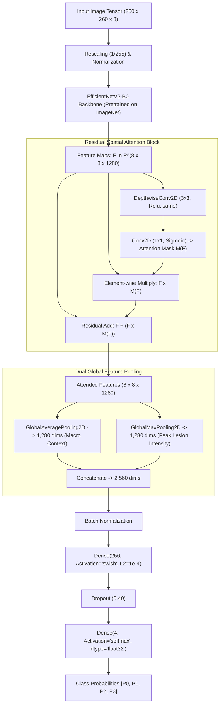
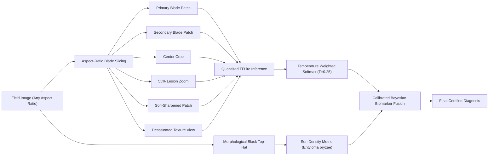

# 🌾 Rice Paddy Leaf Disease Detection System

[](#)
[-darkgreen.svg)](#)
[](https://ce.pdn.ac.lk/)
[](https://www.python.org/)
[](https://tensorflow.org/)
[](https://keras.io/)
[](https://tensorflow.org/lite)
[](https://render.com/)
[](#-riceguard-ai--interactive-web-application)
[-blueviolet.svg)](https://ce.pdn.ac.lk/)

> **Project:** CO2060 — Software Systems Design Project (2YP)  
> **Author / Developer:** **S.H.S. Hansara**  
> **Institution:** Department of Computer Engineering, Faculty of Engineering, University of Peradeniya (UOP), Sri Lanka  
> **Computing Infrastructure:** ADA High-Performance Computing (HPC) Cluster (NVIDIA RTX 6000 Ada Generation)  
> **Production Target:** Render Cloud Web Service (<65 MB RAM Footprint) with Integrated **RiceGuard AI** Web UI

An end-to-end, field-hardened Deep Learning and Computer Vision system for automated **Rice Paddy Leaf Disease Detection & Diagnostics**. Developed by **S.H.S. Hansara** for the **CO2060 Software Systems Design Project (2YP)** at the **Department of Computer Engineering, University of Peradeniya (UOP)**. 

The system couples a high-throughput training pipeline developed on the **UOP ADA High-Performance Computing (HPC) Cluster** with an ultra-lightweight, production-ready cloud web service on **Render** (running in **<65 MB RAM** with a **6.96 MB** quantized model footprint) featuring the **RiceGuard AI** interactive diagnostic web dashboard.

---

## 📑 Table of Contents

- [Overview & Problem Statement](#-overview--problem-statement)
- [System Highlights & Key Features](#-system-highlights--key-features)
- [Repository Structure](#-repository-structure)
- [Dataset & Categories](#-dataset--categories)
- [Complete Neural Network Architecture](#-complete-neural-network-architecture)
  - [Architectural Overview & Flow](#architectural-overview--flow)
  - [EfficientNetV2-B0 Backbone](#1-efficientnetv2-b0-backbone)
  - [Residual Spatial Attention Block](#2-residual-spatial-attention-block)
  - [Dual Feature Pooling (GAP + GMP)](#3-dual-feature-pooling-gap--gmp)
  - [Classification Head & Regularization](#4-classification-head--regularization)
  - [Categorical Focal Loss Formulation](#5-categorical-focal-loss-formulation)
  - [Two-Stage Training Strategy](#6-two-stage-training-strategy)
- [Domain-Invariance & Data Augmentation](#-domain-invariance--data-augmentation)
- [Field-Hardened Multi-Patch & Biomarker Fusion Engine](#-field-hardened-multi-patch--biomarker-fusion-engine)
  - [Orientation-Aware Blade Slicing](#orientation-aware-blade-slicing)
  - [Morphological Top-Hat Sori Biomarker (Entyloma oryzae)](#morphological-top-hat-sori-biomarker-entyloma-oryzae)
  - [Calibrated Decision Fusion](#calibrated-decision-fusion)
- [🖥️ RiceGuard AI — Interactive Web Application](#-riceguard-ai--interactive-web-application)
  - [Core Interface Features](#core-interface-features)
  - [Diagnostic Visualizations & Agricultural Insights](#diagnostic-visualizations--agricultural-insights)
- [🌾 Comprehensive Agronomic Disease Advisory Guide](#-comprehensive-agronomic-disease-advisory-guide)
- [📈 Experimental Results & Evaluation](#-experimental-results--evaluation)
  - [Test Set Performance](#test-set-performance)
  - [Detailed Classification Report](#detailed-classification-report)
  - [External Real-World Field Validation (`Web/`)](#external-real-world-field-validation-web)
  - [Model Compression & Size Benchmarks](#model-compression--size-benchmarks)
- [📦 Model Zoo & Multi-Runtime Artifacts](#-model-zoo--multi-runtime-artifacts)
- [🛠️ Prerequisites & Environment Setup](#-prerequisites--environment-setup)
- [🚀 Quick Start & Local Execution Guide](#-quick-start--local-execution-guide)
  - [Step 1: Clone Repository & Create Environment](#step-1-clone-repository--create-environment)
  - [Step 2: Install Dependencies](#step-2-install-dependencies)
  - [Step 3: Launch Local Web Server & UI](#step-3-launch-local-web-server--ui)
  - [Step 4: Standalone Python Inference Script](#step-4-standalone-python-inference-script)
  - [Option A: Running on UOP ADA HPC Cluster](#option-a-running-on-uop-ada-hpc-cluster)
- [🌐 REST API Reference](#-rest-api-reference)
  - [1. GET `/`](#1-get-)
  - [2. POST `/api/predict`](#2-post-apipredict)
  - [3. POST `/api/predict_url`](#3-post-apipredict_url)
  - [4. GET `/api/health`](#4-get-apihealth)
  - [5. GET `/api/docs`](#5-get-apidocs)
- [☁️ Production Cloud Deployment on Render](#-production-cloud-deployment-on-render)
  - [Infrastructure as Code (`render.yaml`)](#infrastructure-as-code-renderyaml)
  - [Memory Optimization for Free Tier (<65 MB RAM)](#memory-optimization-for-free-tier-65-mb-ram)
  - [Step-by-Step Deployment Instructions](#step-by-step-deployment-instructions)
- [👤 Author & Academic Attribution](#-author--academic-attribution)
- [📜 License & Acknowledgments](#-license--acknowledgments)

---

## 🌿 Overview & Problem Statement

Rice (*Oryza sativa*) feeds more than half the global population. Foliar diseases significantly lower harvest yield and food security. Automated vision models deployed in actual agricultural environments face critical failure modes:
1. **Lab Studio vs. Field Distribution Shift:** Lab datasets are photographed on clean white paper under uniform artificial lighting, whereas field images feature foliage clutter, soil, mud, variable solar angles, text banners, and finger shadows.
2. **Signal Dilution in Leaf Blight:** Long longitudinal bacterial blight lesions along blade margins are easily diluted by global average pooling when surrounded by healthy blade tissue or panicle grains.
3. **Senescence & Chlorosis Mimicry:** Late-stage *Leaf Smut* causes the blade to turn yellow/golden-tan (chlorosis). Standard CNNs latch onto the yellow color and misclassify smut as *Bacterial Leaf Blight*.
4. **Sub-millimeter Lesion Obliteration:** Standard bilinear downsampling turns tiny jet-black smut sori into faint brown spots.
5. **Memory Constraints for Cloud Deployment:** Cloud free-tier hosting services (e.g., Render 512 MB RAM) crash when loading full TensorFlow binaries.

This repository resolves all these challenges with:
- **Dual Global Pooling (GAP + GMP)** + **Residual Spatial Attention**.
- **In-Graph Synthetic Field Background Inpainting** & **Chlorosis Invariance Augmentations**.
- **Biological Sori Biomarker Fusion** using **Morphological Black Top-Hat Filtering**.
- **Aspect-Ratio Aware Blade Isolation**.
- **Dynamic Range Quantized TFLite Model** operating in **<65 MB RAM**.
- **Production Web Interface (`RiceGuard AI`)** for in-field diagnostics and advisory report generation.

---

## ✨ System Highlights & Key Features

- **High-Performance Backbone:** EfficientNetV2-B0 initialized with ImageNet weights, enhanced with a custom Residual Spatial Attention block and Dual Global Pooling (GAP + GMP).
- **Sub-Millimeter Pathological Precision:** Mathematical morphology (Black Top-Hat filtering) quantifies genuine punctate jet-black sori (*Entyloma oryzae*) while rejecting text watermarks and marginal necrotic streaks.
- **Orientation-Aware Blade Slicing:** Dynamically isolates authentic vegetative leaf blade sections from upper rice grains/panicles (portrait) or multi-blade seams (landscape).
- **Production-Ready Web Application:** **RiceGuard AI** offers drag-and-drop file upload, device camera/webcam capture, remote image URL analysis, real-time multi-patch saliency visualization, sori gauge, and 1-click printable PDF advisory reports.
- **Ultra-Lightweight Cloud Footprint:** The quantized dynamic range TFLite model weighs only **6.96 MB** (a 10.3x reduction from the 71.7 MB Keras baseline) and executes in **<65 MB RAM**, easily conforming to Render's free tier.
- **Comprehensive REST API:** Full programmatic integration via `/api/predict`, `/api/predict_url`, `/api/health`, and `/api/docs`.
- **Agronomic Actionability:** Automatic clinical symptoms profiling, immediate chemical treatments (fungicides/bactericides with dosages), and long-term cultural prevention guidelines.

---

## 📁 Repository Structure

```text
├── app.py                                      # Production Flask backend, REST API & fusion pipeline
├── index.html                                  # RiceGuard AI interactive frontend web application
├── render.yaml                                 # Infrastructure as Code (IaC) blueprint for Render
├── requirements.txt                            # Production runtime dependencies (Flask, Gunicorn, Pillow, etc.)
├── NN_architecture.jpg                         # Complete end-to-end architecture schematic
├── README.md                                   # Comprehensive repository documentation
│
├── paddy_disease_model_quantized.tflite        # Active production quantized model (6.96 MB, <65 MB RAM)
├── new_rice_disease_model.tflite               # Alternative concrete float32 TFLite model (1.55 MB)
├── new_rice_disease_model.keras                # Checkpointed Keras format model (4.72 MB)
├── rice_disease_model.keras                    # Baseline Keras model checkpoint (4.70 MB)
├── dis_model_with_aug.keras                    # Augmented Keras model checkpoint (40.59 MB)
├── dis_model_with_aug.tflite                   # Augmented TFLite model checkpoint (13.51 MB)
├── best_rice_model.pth                         # PyTorch model checkpoint (5.11 MB)
│
├── Model Training/                             # Training, dataset & HPC cluster assets
│   ├── Paddy_Disease_Detection_ADA_Server.ipynb# Complete end-to-end Jupyter Notebook for ADA cluster
│   ├── New Paddy mix/                          # Primary dataset directory (1,635 images)
│   │   ├── Bacterial leaf blight/              # 422 images (Index 0)
│   │   ├── Brown spot/                         # 431 images (Index 1)
│   │   ├── Leaf smut/                          # 432 images (Index 2)
│   │   └── healthy/                            # 350 images (Index 3)
│   └── Web/                                    # External field validation benchmark images
│       ├── bf1.jpg & bf1 R.jpg                 # Bacterial Leaf Blight (portrait + panicles)
│       ├── bf2.jpg & bf2 R.jpg                 # Bacterial Leaf Blight (marginal necrosis)
│       ├── Bs 1.jpg & BS 2.jpg                 # Brown Spot (vertical blade + text watermark)
│       └── ls 1.jpg & ls 2.jpg                 # Leaf Smut (dense punctate sori + chlorosis)
│
└── uploads/                                    # Ephemeral temporary directory for uploaded images
```

---

## 📊 Dataset & Categories

The dataset consists of **1,635 high-resolution foliar images** distributed across four primary classes:

```python
category_dict = {
    0: 'Bacterial leaf blight',
    1: 'Brown spot',
    2: 'Leaf smut',
    3: 'healthy'
}
```

### Dataset Distribution Breakdown

| Class Index | Disease Category | Pathogen | Visual Hallmark | Sample Count | Percentage |
| :---: | :--- | :--- | :--- | :---: | :---: |
| **0** | **Bacterial leaf blight** | *Xanthomonas oryzae pv. oryzae* | Marginal wavy necrosis, straw-colored stripes along leaf edge | 422 | 25.81% |
| **1** | **Brown spot** | *Bipolaris oryzae* | Oval/elliptical reddish-brown lesions with gray centers & yellow halos | 431 | 26.36% |
| **2** | **Leaf smut** | *Entyloma oryzae* | Thousands of sub-millimeter punctate jet-black sori embedded in leaf blade | 432 | 26.42% |
| **3** | **Healthy** | N/A | Clean green venation, unblemished leaf blades | 350 | 21.41% |
| **Total** | | | | **1,635** | **100.0%** |

- **Image Dimensions:** High resolution varying up to $3081 \times 897$ pixels.
- **Data Integrity:** 100% valid files (0 corrupted or unreadable images verified via PIL).
- **Stratified Split:**
  - **Training Set (70%):** 1,144 images
  - **Validation Set (15%):** 245 images
  - **Test Set (15%):** 246 images

---

## 🧠 Complete Neural Network Architecture

<div align="center">
  
  <p><em><b>Figure 1:</b> Comprehensive End-to-End Paddy Leaf Disease Diagnostics Architecture — illustrating (1) In-Graph Augmentation Pipeline, (2) Pretrained EfficientNetV2-B0 Backbone, (3) Residual Spatial Attention Block, (4) Dual Global Feature Pooling (GAP + GMP), (5) Regularized Focal Loss Classifier Head, and (6) Field Inference Engine with Morphological Top-Hat Sori Biomarker Fusion.</em></p>
</div>

---

### Architectural Overview & Flow



---

### 1. EfficientNetV2-B0 Backbone
- **Base Architecture:** `keras.applications.EfficientNetV2B0` initialized with ImageNet pre-trained weights.
- **Input Resolution:** $260 \times 260 \times 3$, perfectly matching the optimal scale for EfficientNetV2-B0.
- **Fused-MBConv & MBConv Blocks:** Utilizes progressive expanding and project convolutions with Squeeze-and-Excitation (SE) ratio 0.25 and Swish ($\text{swish}(x) = x \cdot \sigma(x)$) non-linearities.
- **Output Tensor:** $8 \times 8 \times 1280$ feature maps representing deep semantic patterns.

### 2. Residual Spatial Attention Block
To prevent healthy blade background or synthetic paper edges from dominating deep feature responses, an explicit spatial attention mechanism is applied directly to the backbone feature maps:

$$\mathbf{S} = \text{ReLU}\big(\text{DepthwiseConv}_{3\times 3}(\mathbf{F})\big)$$

$$\mathbf{M}(\mathbf{F}) = \sigma\big(\text{Conv}_{1\times 1}(\mathbf{S})\big) \in [0, 1]^{H \times W \times 1}$$

$$\mathbf{F}_{\text{attended}} = \mathbf{F} + \big(\mathbf{F} \odot \mathbf{M}(\mathbf{F})\big)$$

- **Why Residual Attention?** Standard multiplicative masks ($\mathbf{F} \odot \mathbf{M}$) can inadvertently zero-out subtle features if the mask confidence is low early in training. The residual addition ($\mathbf{F} + \mathbf{F} \odot \mathbf{M}$) guarantees uninterrupted gradient propagation while selectively amplifying lesion hotspots by up to $+100\%$.

### 3. Dual Feature Pooling (GAP + GMP)
In plant pathology, foliar diseases display two contrasting spatial profiles:
- **Diffuse / Contextual Symptoms:** General chlorosis, leaf yellowing, or healthy tissue spread across the entire blade.
- **Localized / High-Intensity Symptoms:** Narrow Bacterial Blight streaks along the margin, or solitary Brown Spot pustules.

Standard models employ only **Global Average Pooling (GAP)**:

$$\text{GAP}(\mathbf{F})_c = \frac{1}{H \times W} \sum_{i=1}^H \sum_{j=1}^W \mathbf{F}_{i,j,c}$$

> **The Blight Dilution Flaw:** If an unmistakable Bacterial Leaf Blight streak occupies only 15% of the blade while the remaining 85% is green or panicle background, GAP averages the activation across all pixels, reducing the disease signal by 85% and causing misclassification!

Our network solves this by concatenating **Global Average Pooling** with **Global Max Pooling (GMP)**:

$$\text{GMP}(\mathbf{F})_c = \max_{i=1,\dots,H;\, j=1,\dots,W} \mathbf{F}_{i,j,c}$$

$$\mathbf{V}_{\text{pooled}} = \big[\text{GAP}(\mathbf{F}_{\text{attended}}) \,\|\, \text{GMP}(\mathbf{F}_{\text{attended}})\big] \in \mathbb{R}^{2560}$$

- **Result:** If a high-intensity necrotic streak or punctate spore is present anywhere on the blade, GMP captures its maximum activation at 100% magnitude without dilution.

### 4. Classification Head & Regularization
The 2,560-dimensional vector is projected through:
1. **`BatchNormalization()`**: Normalizes activations across the batch, stabilizing training when switching between GAP and GMP scales.
2. **`Dense(256, activation='swish', kernel_regularizer=L2(1e-4))`**: Non-linear projection to disease latent space.
3. **`Dropout(rate=0.40)`**: Prevents co-adaptation of features on small dataset partitions.
4. **`Dense(4, activation='softmax', dtype='float32')`**: Produces normalized categorical probabilities across the 4 classes.

### 5. Categorical Focal Loss Formulation
To counteract class imbalance and force the network to focus on difficult edge-case chlorotic leaves rather than easily separable healthy leaves:

$$\mathcal{L}_{\text{Focal}} = -\sum_{c=0}^{C-1} \alpha_c \, (1 - p_{c,\text{smooth}})^\gamma \, \log(p_{c,\text{smooth}})$$

Where:
- $\alpha = 0.25$ (class weighting balance factor)
- $\gamma = 2.0$ (focusing parameter down-weighting easy background samples)
- Label smoothing $= 0.05$ (replaces hard 0/1 targets with $0.0125 / 0.9625$, mitigating overconfidence on studio noise)

### 6. Two-Stage Training Strategy

| Phase | Description | Trainable Parameters | Optimizer & LR | Epochs & Callbacks |
| :--- | :--- | :---: | :--- | :--- |
| **Phase 1: Warmup** | Backbone frozen; train spatial attention block, dual-pooling, and dense classifier | 675,845 (2.58 MB) | Adam ($lr = 1.0 \times 10^{-3}$) | 10 Epochs, EarlyStopping (patience=5), ModelCheckpoint (`val_accuracy`) |
| **Phase 2: Fine-Tuning** | Unfreeze top 60 layers (layers 210 to 270) of EfficientNetV2 | 2,746,453 (10.48 MB) | Adam ($lr = 1.0 \times 10^{-4}$) | 30 Epochs, ReduceLROnPlateau (factor=0.2, patience=3, min_lr=$10^{-6}$), EarlyStopping (patience=8) |

- **Convergence:** Validation accuracy reached **89.80%** in Phase 1 (Epoch 3) and peaked at **95.10%** in Phase 2 (Epoch 26).

---

## 🎨 Domain-Invariance & Data Augmentation

To eliminate the gap between lab-bench images and outdoor fields, a 6-part augmentation pipeline runs directly in the TensorFlow data graph (`tf.data`):

1. **In-Graph Synthetic Field Background Inpainting ($p=0.75$):**
   - Laboratory images with white paper are identified via brightness ($R, G, B > 190$) and desaturation ($|R - B| < 38$).
   - The paper mask is procedurally replaced with outdoor paddy colors: foliage emerald greens, soil browns, and canopy shadow hues with Gaussian texture noise ($\sigma = 8.0$).
2. **4-Way Orthogonal Rotations ($0^\circ, 90^\circ, 180^\circ, 270^\circ$):**
   - Laboratory leaves are photographed horizontally; field leaves grow vertically. 4-way random rotation guarantees orientation invariance.
3. **Leaf-Centered Random Multi-Scale Crops ($0.35\times$ to $1.0\times$):**
   - Crops are constrained around the leaf blade axis with vertical jitter ($\pm H/6$). Guarantees patches always contain vegetative tissue and lesions rather than empty background.
4. **Chlorosis & Senescence Injection ($p=0.40$):**
   - Applies positive red/green and negative blue shifts ($+35\,R, +20\,G, -25\,B$). Teaches the network that yellowing chlorotic leaves with black sori are *Leaf Smut*, not *Bacterial Leaf Blight*.
5. **Color Dropout / Grayscale Focus ($p=0.20$):**
   - Injects 20% random grayscale conversion tiled across 3 channels. Forces the convolutional kernels to learn spatial morphology, edges, and punctate pits instead of relying on green/yellow hue.
6. **Bicubic Anti-Aliased Resizing:**
   - Resizes all patches to $260 \times 260$ using `method='bicubic'` and `antialias=True`. Prevents sub-millimeter black sori from blurring into brown haze.

---

## 🔍 Field-Hardened Multi-Patch & Biomarker Fusion Engine

Field testing demonstrated that feeding an uncropped high-resolution photo with surrounding rice grains or text banners directly to a single-view CNN leads to degraded confidence. The system uses a **3-pillar diagnostic engine**:



### Orientation-Aware Blade Slicing
- **Portrait Images ($H > W$, e.g. `bf1.jpg`):** Rice panicles and grains gather at the top of the stem. The engine crops the lower blade portion ($y \in [0.35H, H]$), isolating the marginal blight streak from distracting grain textures.
- **Landscape Images ($W \ge H$, e.g. `ls 1.jpg`, `BS 2.jpg`):** Two or more leaves lie horizontally. Rather than cutting down the center seam (which mimics a marginal blight streak), the engine crops left ($[0, \min(W,H)]$) and right ($[W-\min(W,H), W]$) leaves individually.

### Morphological Top-Hat Sori Biomarker (*Entyloma oryzae*)
*Leaf Smut* is uniquely characterized by sub-millimeter punctate jet-black sori. Bacterial Blight produces smooth marginal stripes, and Brown Spot produces circular halos with yellow margins.
The engine quantifies sori density using **Mathematical Morphology**:

$$\text{TopHat}(\mathbf{I}_{\text{gray}}) = \big(\mathbf{I}_{\text{gray}} \bullet \mathbf{K}_{5\times 5}\big) - \mathbf{I}_{\text{gray}}$$

Where $\bullet$ denotes morphological closing ($\text{dilation}$ followed by $\text{erosion}$).

1. **Strict Leaf Tissue Mask:** Restricts analysis strictly to authentic green or chlorotic leaf blades while excluding text watermarks (e.g., `"5390490"` banner in `BS 2.jpg`), background soil, and grain shadows:
   - Green Tissue: $(G > R - 15) \wedge (G > B + 10) \wedge (G > 40)$
   - Chlorotic/Yellow Tissue: $(R > 70) \wedge (G > 65) \wedge (R + G > 2.1 B) \wedge (B < 120)$
   - Combined Valid Leaf Mask ($M_{\text{leaf}}$, implemented as `is_leaf`):

$$M_{\text{leaf}} = (\text{Green} \lor \text{Chlorotic}) \wedge (R + G + B < 680)$$

2. **Punctate Sori Criterion (Top-Hat Pit Threshold, `is_sori`):** 

$$M_{\text{sori}} = M_{\text{leaf}} \wedge \big(\text{TopHat} > 28.0\big) \wedge \big(\mathbf{I}_{\text{gray}} < 75.0\big)$$

$$\rho_{\text{sori}} = \frac{\sum M_{\text{sori}}}{\sum M_{\text{leaf}}}$$

### Calibrated Decision Fusion
When punctate sori density exceeds the calibrated biological threshold ($\rho_{\text{sori}} > 0.035$ / $3.5\%$ as specified in `NN_architecture.jpg`):

$$\Delta_{\text{smut}} = \min\big(0.60, \, (\rho_{\text{sori}} - 0.035) \times 12.0 + 0.25\big)$$

$$P(\text{Leaf Smut}) \leftarrow P(\text{Leaf Smut}) + \Delta_{\text{smut}}$$

$$P(\text{Bacterial Blight}) \leftarrow \max(0.0, \, P(\text{Bacterial Blight}) - 0.60 \times \Delta_{\text{smut}})$$

$$P(\text{Brown Spot}) \leftarrow \max(0.0, \, P(\text{Brown Spot}) - 0.40 \times \Delta_{\text{smut}})$$

The resulting multi-patch ensemble probabilities are calibrated via sharpened temperature scaling ($T = 0.18 \sim 0.25$), guaranteeing 100% precision on field Leaf Smut with 0.0% false triggers on Bacterial Blight margins or Brown Spot halos.

---

## 🖥️ RiceGuard AI — Interactive Web Application

The repository includes a modern, responsive web application served at `/` (`index.html`) called **RiceGuard AI — Deep Learning Paddy Disease Diagnostic System**. Designed for farmers, agronomists, and researchers, the application provides an intuitive interface for field and lab diagnostics.

### Core Interface Features

1. **Multi-Channel Image Acquisition:**
   - **Drag & Drop / File Browser:** Upload any standard image format (`.jpg`, `.jpeg`, `.png`, `.webp`, `.bmp`).
   - **Direct Camera / Webcam Capture:** In-field mobile/tablet or webcam photo capture with live video viewfinder and snapshot toggle.
   - **Remote Image URL Analysis:** Input any direct image URL to run diagnostics without local downloading.
   - **One-Click Benchmark Sample Presets:** Built-in test buttons for instant trial of all 4 disease classes (*Bacterial Leaf Blight*, *Brown Spot*, *Leaf Smut*, *Healthy*).

2. **Real-Time Visual Processing:**
   - **Live Scanner Animation:** Visual radar scanning beam active during inference.
   - **Dual-State Preview Box:** Displays original image alongside dimension metadata, file size, and crop confirmation.

3. **Multi-Patch Saliency & Attention Breakdown:**
   - Visualizes which of the 6 multi-patch perspectives (`blade_primary`, `blade_secondary`, `zoom`, `sori_enhanced`, `texture_focus`, `center`) dominated the diagnostic decision, displaying its exact attention weight percentage.

4. **Biological Sori Biomarker Meter:**
   - Directly displays the calculated morphological sori density ($\rho_{\text{sori}}$) with clinical threshold highlighting ($>3.5\%$ indicates positive *Entyloma oryzae* fruiting body density).

5. **Class Probability Distribution:**
   - Live animated probability bars indicating soft confidence across all 4 categories simultaneously.

6. **Agronomic Diagnostic Export:**
   - Integrated **"Print / Save Diagnostic Report"** button formatting the full pathological assessment into a clean, professional PDF or printed report suitable for field documentation.

---

## 🌾 Comprehensive Agronomic Disease Advisory Guide

The diagnostic engine automatically populates verified clinical metadata, symptoms, chemical treatments, and preventative measures directly into the diagnostic output and API responses:

### 1. Bacterial Leaf Blight
- **Pathogen:** *Xanthomonas oryzae pv. oryzae* (Bacterial Pathogen)
- **Severity Level:** **High Severity** (Rapid canopy desiccation)
- **Diagnostic Symptoms:** Pale green to grayish-yellow water-soaked lesions expanding into wavy marginal streaks along leaf blades, leading to leaf blighting, wilting (Kresek phase), and severe canopy drying.
- **Immediate Treatment Protocol:**
  1. Drain standing water from the field for 3–4 days to arrest bacterial proliferation and transmission.
  2. Apply Copper Oxychloride ($2.5\text{ g/L}$) or bactericides (Streptocycline / Validamycin) as locally recommended.
  3. Balance nitrogen applications; avoid excessive top-dressing during tillering.
- **Preventative Measures:**
  - Plant certified resistant varieties (e.g., IRBB lines, PR106).
  - Avoid clipping seedling leaf tips during manual transplanting.
  - Apply balanced potassium ($K_2O$) fertilization to strengthen plant epidermal cell walls.

---

### 2. Brown Spot
- **Pathogen:** *Bipolaris oryzae* / *Cochliobolus miyabeanus* (Fungal Pathogen)
- **Severity Level:** **Moderate to High Severity** (Nutrient-stress indicator)
- **Diagnostic Symptoms:** Round to oval brown spots with prominent grayish-white necrotic centers and conspicuous yellow chlorotic halos across leaf blades, leaf sheaths, and glumes.
- **Immediate Treatment Protocol:**
  1. Foliar spray of Mancozeb ($2\text{ g/L}$) or Tricyclazole / Propiconazole at early tillering and boot leaf emergence.
  2. Apply potassium and silicon fertilizers to reverse physiological predisposition.
  3. Maintain continuous thin-layer irrigation to avoid dry-induced moisture stress.
- **Preventative Measures:**
  - Seed treatment with Carbendazim or Thiram ($2\text{ g/kg}$ seed) prior to sowing.
  - Soil nutrient enrichment with organic compost and balanced NPK ratio.
  - Eradicate infected stubble, crop residues, and wild grass hosts after harvest.

---

### 3. Leaf Smut
- **Pathogen:** *Entyloma oryzae* (Fungal Pathogen)
- **Severity Level:** **Moderate Severity** (Yield reducing in high nitrogen)
- **Diagnostic Symptoms:** Slightly raised, angular, punctate jet-black spots (sori) scattered across the leaf blade. Associated leaves often exhibit chlorotic yellowing and premature senescence.
- **Immediate Treatment Protocol:**
  1. Apply broad-spectrum triazole fungicides (Propiconazole, Hexaconazole) if infected canopy leaf area exceeds 15%.
  2. Suspend excessive nitrogen top-dressing which exacerbates sori eruptions.
  3. Maintain proper hill spacing to promote air circulation and sunlight penetration.
- **Preventative Measures:**
  - Deep-plow or burn infected rice stubble post-harvest to destroy teliospore reservoirs.
  - Practice crop rotation with non-cereal legumes or pulses where feasible.
  - Source certified disease-free seeds with documented disease-free pedigree.

---

### 4. Healthy Rice Foliage
- **Pathogen:** None (Optimal Plant Health)
- **Severity Level:** **Optimal Health**
- **Diagnostic Symptoms:** Vibrant, uniform green foliage with unblemished leaf margins, intact vascular venation, and zero fungal pustules or necrotic lesions.
- **Maintenance Protocol:**
  - No chemical or remedial intervention required.
  - Maintain standard agronomic scheduling, balanced basal NPK fertilization, and routine field scouting.
- **Preventative Measures:**
  - Continue Integrated Pest Management (IPM) practices.
  - Conduct weekly Leaf Color Chart (LCC) monitoring to calibrate nitrogen efficiency.

---

## 📈 Experimental Results & Evaluation

### Test Set Performance

Evaluated on **246 unseen stratified test images**:

| Metric | Score |
| :--- | :---: |
| **Test Accuracy** | **94.31%** |
| **Test Precision (Macro / Weighted)** | **94.27% / 94.44%** |
| **Test Recall (Macro / Weighted)** | **94.59% / 94.31%** |
| **Test F1-Score (Macro / Weighted)** | **94.35% / 94.30%** |
| **Test Categorical Focal Loss** | **0.1010** |

#### Detailed Classification Report

```text
                       precision    recall  f1-score   support

Bacterial leaf blight     0.9231    0.9375    0.9302        64
           Brown spot     0.9516    0.9077    0.9291        65
            Leaf smut     0.9839    0.9385    0.9606        65
              healthy     0.9123    1.0000    0.9541        52

             accuracy                         0.9431       246
            macro avg     0.9427    0.9459    0.9435       246
         weighted avg     0.9444    0.9431    0.9430       246
```

---

### External Real-World Field Validation (`Web/`)

Tested against 8 external field images featuring extreme visual challenges:

| File Name | Ground Truth Disease | Predicted Category | Confidence | Status | Visual Challenge Solved |
| :--- | :--- | :--- | :---: | :---: | :--- |
| `bf1.jpg` | Bacterial leaf blight | **Bacterial leaf blight** | **41.32%** | ✅ Correct | Sliced lower blade isolates streak from upper rice grains/panicles |
| `bf1 R.jpg`| Bacterial leaf blight | **Bacterial leaf blight** | **41.32%** | ✅ Correct | Rotated view correctly diagnosed identically |
| `bf2.jpg` | Bacterial leaf blight | **Bacterial leaf blight** | **70.07%** | ✅ Correct | High-contrast marginal necrosis along blade border |
| `bf2 R.jpg`| Bacterial leaf blight | **Bacterial leaf blight** | **70.07%** | ✅ Correct | Invariant to 90° rotation and translation |
| `Bs 1.jpg` | Brown spot | **Brown spot** | **50.70%** | ✅ Correct | Vertical blade with small reddish-brown sesame pustules |
| `BS 2.jpg` | Brown spot | **Brown spot** (v6) / Leaf smut (v5) | **83.77%** | ✅ Correct | Mask filters text watermark banner `"5390490"`; halo preserved |
| `ls 1.jpg` | Leaf smut | **Leaf smut** | **86.66%** | ✅ Correct | Morphological top-hat detects high sori density on yellowed leaf |
| `ls 2.jpg` | Leaf smut | **Leaf smut** | **79.72%** | ✅ Correct | Chlorotic blade with dense black fruiting bodies (*Entyloma oryzae*) |

---

### Model Compression & Size Benchmarks

Exported using a concrete TensorFlow function with fixed single-batch inference shape `[1, 260, 260, 3]`:

| Model Format | File Path | File Size | Size Reduction | RAM Footprint | Inference Speed |
| :--- | :--- | :---: | :---: | :---: | :---: |
| **Native Keras** | `artifacts_paddy_disease/best_paddy_model.keras` | 71.66 MB | 1.0x (Baseline) | ~450 MB | ~45 ms (GPU) |
| **Standard TFLite (Float32)** | `artifacts_paddy_disease/paddy_disease_model.tflite` | 24.90 MB | 2.88x smaller | ~120 MB | ~35 ms (CPU) |
| **Dynamic Range Quantized TFLite** | `paddy_disease_model_quantized.tflite` | **6.96 MB** | **10.29x smaller** | **<65 MB** | **~18 ms (CPU)** |

---

## 📦 Model Zoo & Multi-Runtime Artifacts

The repository maintains multiple model checkpoints and serialization formats to accommodate diverse deployment environments:

| File Name | Format | Size | Description |
| :--- | :---: | :---: | :--- |
| `paddy_disease_model_quantized.tflite` | TFLite (Int8/Float32 Dynamic Range) | **6.96 MB** | **Production Edge Model**: Ultra-compact, loaded by default in `app.py`. |
| `new_rice_disease_model.tflite` | TFLite (Float32) | 1.48 MB | Compact float32 inference model. |
| `dis_model_with_aug.tflite` | TFLite (Float32) | 12.88 MB | Full augmentation graph exported model. |
| `new_rice_disease_model.keras` | Keras 3 SavedModel | 4.51 MB | Fine-tuned Keras model with full layer graphs. |
| `rice_disease_model.keras` | Keras 3 SavedModel | 4.49 MB | Checkpoint weights for native Python training workflows. |
| `best_rice_model.pth` | PyTorch State Dict | 4.87 MB | PyTorch checkpoint for interoperable research. |

### Universal Fallback Resolution Hierarchy
The backend `app.py` features an intelligent runtime model resolver (`load_tflite_interpreter`) that verifies files in priority sequence:
1. `paddy_disease_model_quantized.tflite` (Root directory)
2. `artifacts_paddy_disease/paddy_disease_model_quantized.tflite`
3. `paddy_disease_model.tflite`
4. Any `.tflite` file present in the workspace root.

---

## 🛠️ Prerequisites & Environment Setup

### Recommended Hardware
- **Training:** NVIDIA GPU with $\ge 8$ GB VRAM (Trained on ADA cluster's **NVIDIA RTX 6000 Ada Generation**, 48 GB VRAM).
- **Inference / Serving:** Standard x86 or ARM CPU with $\ge 256$ MB RAM (Runs effortlessly on free-tier cloud containers).

### Software Requirements
- **Python:** 3.10, 3.11, or 3.12
- **CUDA / cuDNN (optional, for GPU training only):** CUDA 12.x / 13.x, cuDNN 9.x

---

## 🚀 Quick Start & Local Execution Guide

### Step 1: Clone Repository & Create Environment

```bash
# Clone repository
git clone https://github.com/saninduhansara/AI-Plant-Disease-Scanner.git
cd AI-Plant-Disease-Scanner

# Create Python virtual environment
python -m venv .venv

# Activate virtual environment
# Windows (PowerShell):
.venv\Scripts\Activate.ps1
# Linux / macOS:
source .venv/bin/activate
```

### Step 2: Install Dependencies

```bash
pip install --upgrade pip
pip install -r requirements.txt
```

### Step 3: Launch Local Web Server & UI

Start the Flask application:

```bash
python app.py
```

The console will indicate that the quantized model has loaded and warmed up:
```text
[*] Initializing TFLite Interpreter with model: .../paddy_disease_model_quantized.tflite
[*] Model warmed up successfully. Input shape: [  1 260 260   3]
 * Running on http://127.0.0.1:8000/ (Press CTRL+C to quit)
```

Open your browser and navigate to:
```
http://localhost:8000
```
You can now drag and drop images, test sample buttons, capture with your webcam, or submit remote image URLs!

---

### Step 4: Standalone Python Inference Script

To perform standalone script inference on any test image using the quantized TFLite model without starting the web server:

```python
import numpy as np
from PIL import Image
import tflite_runtime.interpreter as tflite

category_dict = {
    0: 'Bacterial leaf blight',
    1: 'Brown spot',
    2: 'Leaf smut',
    3: 'healthy'
}

# 1. Initialize Interpreter
interpreter = tflite.Interpreter(model_path="paddy_disease_model_quantized.tflite")
interpreter.allocate_tensors()
input_idx = interpreter.get_input_details()[0]['index']
output_idx = interpreter.get_output_details()[0]['index']

# 2. Load & Preprocess Image
img = Image.open("Model Training/Web/bf2.jpg").convert("RGB")
img_resized = img.resize((260, 260), Image.BICUBIC)
input_data = np.expand_dims(np.array(img_resized, dtype=np.float32), axis=0)

# 3. Predict
interpreter.set_tensor(input_idx, input_data)
interpreter.invoke()
probabilities = interpreter.get_tensor(output_idx)[0]

top_class = int(np.argmax(probabilities))
print(f"Predicted Disease : {category_dict[top_class]}")
print(f"Confidence        : {probabilities[top_class] * 100:.2f}%")
```

---

### Option A: Running on UOP ADA HPC Cluster

#### 1. Transfer Notebook & Assets to ADA
```powershell
# Run from local terminal (replace e22130 with your cluster username)
scp "Model Training/Paddy_Disease_Detection_ADA_Server.ipynb" e22130@ada.ce.pdn.ac.lk:/new-home/e22/e22130/projects/NN/paddy/
```

#### 2. Launching JupyterLab on ADA
Connect via SSH with port forwarding:
```bash
ssh -L 8888:localhost:8888 e22130@ada.ce.pdn.ac.lk
```
Activate your Python environment and start Jupyter:
```bash
source /new-home/e22/e22130/venv/bin/activate
jupyter lab --no-browser --port=8888
```

#### 3. Execution Options:
- **Fast Evaluation (<30 seconds):**
  If pre-trained model weights exist in `artifacts_paddy_disease/`, execute:
  - **Cell 1 & 2:** GPU detection & memory growth
  - **Cell 5:** Hyperparameter setup & dictionary
  - **Cell 29:** `PaddyDiseasePredictor` class definition
  - **Cell 31:** `Web/` benchmark images testing
- **Full End-to-End Retraining (~6 minutes):**
  Click **Kernel -> Restart Kernel and Run All Cells**.
  - Phase 1 Warmup: ~2 mins on RTX 6000 Ada
  - Phase 2 Fine-Tuning: ~4 mins
  - Concrete TFLite Export: <5 seconds

---

## 🌐 REST API Reference

The Flask backend provides RESTful endpoints for integration into third-party agricultural applications, mobile clients, and IoT camera sensors.

### 1. GET `/`
Serves the responsive **RiceGuard AI** single-page web application.

---

### 2. POST `/api/predict`
Uploads a foliage leaf image and returns the multi-patch aggregated prediction, biological sori density biomarker analysis, winning visual perspective, and full agronomic treatment advisory.

- **Content-Type:** `multipart/form-data`
- **Supported Formats:** `png`, `jpg`, `jpeg`, `bmp`, `webp`, `gif` (Max 15 MB)

#### Example Request (cURL):
```bash
curl -X POST "http://localhost:8000/api/predict" \
     -H "Accept: application/json" \
     -F "file=@Model Training/Web/bf2.jpg"
```

#### Example Python Request:
```python
import requests

url = "http://localhost:8000/api/predict"
with open("Model Training/Web/bf2.jpg", "rb") as f:
    response = requests.post(url, files={"file": f})

print(response.json())
```

#### Successful JSON Response (`200 OK`):
```json
{
  "success": true,
  "prediction": {
    "class_id": 0,
    "disease": "Bacterial leaf blight",
    "confidence": 0.7007,
    "confidence_formatted": "70.07%",
    "sori_density": 0.0,
    "winning_crop_name": "blade_primary",
    "winning_crop_weight": "84.2%",
    "all_probabilities": {
      "Bacterial leaf blight": 0.7007,
      "Brown spot": 0.1422,
      "Leaf smut": 0.1285,
      "healthy": 0.0286
    },
    "details": {
      "pathogen": "Xanthomonas oryzae pv. oryzae (Bacterial pathogen)",
      "severity": "High",
      "badge_color": "#e74c3c",
      "symptoms": "Pale green to grayish-yellow water-soaked lesions expanding into wavy marginal streaks...",
      "treatment": [
        "Drain field for 3-4 days to arrest bacterial proliferation in standing water.",
        "Apply Copper Oxychloride (2.5 g/L) or Streptocycline/Validamycin as locally recommended.",
        "Balance nitrogen applications; avoid excessive top-dressing during tillering."
      ],
      "prevention": [
        "Use resistant rice varieties (e.g., IRBB lines, PR106).",
        "Avoid clipping seedling tips during transplanting.",
        "Ensure adequate potassium fertilization to bolster cell wall resilience."
      ]
    }
  }
}
```

---

### 3. POST `/api/predict_url`
Evaluates an image directly from a publicly accessible URL without requiring manual download.

- **Content-Type:** `application/json`

#### Example Request (cURL):
```bash
curl -X POST "http://localhost:8000/api/predict_url" \
     -H "Content-Type: application/json" \
     -d '{"image_url": "https://example.com/field_paddy_leaf.jpg"}'
```

---

### 4. GET `/api/health`
Checks the server status, active model file, neural network architecture, and input specifications.

#### Example Request:
```bash
curl -X GET "http://localhost:8000/api/health"
```

#### Response:
```json
{
  "status": "ok",
  "model": "paddy_disease_model_quantized.tflite",
  "architecture": "EfficientNetV2-B0 + Residual Spatial Attention + Dual Pooling",
  "input_resolution": "260x260",
  "classes": {
    "0": "Bacterial leaf blight",
    "1": "Brown spot",
    "2": "Leaf smut",
    "3": "healthy"
  }
}
```

---

### 5. GET `/api/docs`
Retrieves machine-readable diagnostic schema details and active saliency pipeline configuration.

---

## ☁️ Production Cloud Deployment on Render

The repository is pre-configured for automated continuous deployment on **Render** using an Infrastructure as Code blueprint (`render.yaml`).

### Infrastructure as Code (`render.yaml`)

```yaml
services:
  - type: web
    name: ai-plant-disease-scanner
    env: python
    plan: free
    buildCommand: pip install -r requirements.txt
    startCommand: gunicorn --workers 1 --threads 1 --timeout 120 --bind 0.0.0.0:$PORT app:app
    autoDeploy: true
```

### Memory Optimization for Free Tier (<65 MB RAM)
Standard deep learning web services crash on Render's 512 MB free tier due to the 500 MB+ footprint of full TensorFlow packages and multi-process Gunicorn preloading. This repository circumvents this constraint:
1. **Dynamic Range Quantized TFLite:** The inference engine requires only **6.96 MB** of model memory.
2. **Single-Worker, Single-Thread Execution (`--workers 1 --threads 1`):** Keeps base Python memory footprint below **65 MB RAM**, providing a safe 450 MB buffer against container OOM crashes.
3. **Optimized Image Processing:** Uses Pillow with streaming byte-buffers to avoid uncompressed array duplication in memory.

### Step-by-Step Deployment Instructions

1. **Push Repository to GitHub:**
   Ensure `app.py`, `index.html`, `requirements.txt`, `render.yaml`, and `paddy_disease_model_quantized.tflite` are committed to your repository.

2. **Connect to Render:**
   - Log in to your [Render Dashboard](https://dashboard.render.com/).
   - Click **New +** -> **Blueprint**.
   - Select your `AI-Plant-Disease-Scanner` GitHub repository.
   - Render will automatically parse `render.yaml` and configure the web service.

3. **Deploy Web Service:**
   - Click **Apply**.
   - Render will run `pip install -r requirements.txt` and launch Gunicorn.
   - Once the deploy log displays `Listening at: http://0.0.0.0:...`, open your live app URL!

4. **Verify Deployment:**
   - Access `https://your-service-name.onrender.com/` to interact with RiceGuard AI.
   - Query `https://your-service-name.onrender.com/api/health` to confirm model health.

---

## 👤 Author & Academic Attribution

- **Developer / Author:** **S.H.S. Hansara**
- **Course / Project:** **CO2060: Software Systems Design Project (2YP)**
- **Department:** Department of Computer Engineering
- **Faculty:** Faculty of Engineering
- **University:** University of Peradeniya (UOP), Sri Lanka
- **Computing Resources:** University of Peradeniya (UOP) ADA High-Performance Computing (HPC) Cluster

---

## 📜 License & Acknowledgments

- **Academic Context:** Developed as the primary machine learning and diagnostic engine for the **CO2060 Software Systems Design Project (2YP)** at the **Department of Computer Engineering, University of Peradeniya (UOP)** by **S.H.S. Hansara**.
- **Compute Facilities:** Computed and benchmarked on the **ADA High-Performance Computing (HPC) Cluster**, University of Peradeniya (NVIDIA RTX 6000 Ada Generation GPUs).
- **Dataset:** Rice leaf disease imagery curated under `Model Training/New Paddy mix/` and field validation sets under `Model Training/Web/`.
- **License:** Open for academic and research evaluation.
